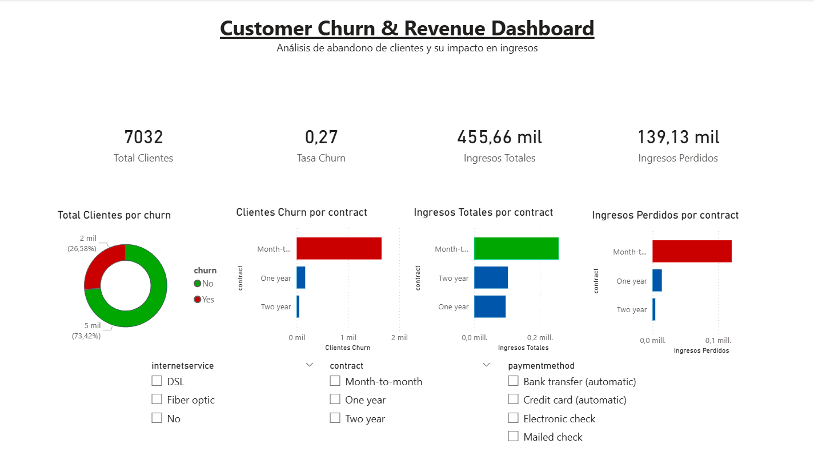

# 📊 Customer Churn & Revenue Analysis

Proyecto end-to-end de análisis de datos centrado en el churn de clientes y su impacto en los ingresos en un modelo de negocio de suscripción (telco).

El objetivo es identificar los principales factores que influyen en el abandono de clientes y extraer insights accionables desde un punto de vista de negocio.

---

## 📊 Dashboard Preview

### 🔹 Resumen Ejecutivo

### 🔹 Análisis de Churn

---

## 🧱 Data Pipeline

- Ingesta de datos (CSV) – dataset Telco Customer Churn (IBM)
- Limpieza y transformación de datos (Python - Pandas)
  - Conversión de `TotalCharges` a formato numérico
  - Eliminación de valores nulos
  - Codificación de variable objetivo (`Churn → 0/1`)
- Análisis exploratorio de datos (EDA)
  - Distribución de churn
  - Análisis por contrato, antigüedad y cargos
- Dataset procesado → `data/processed/clean_churn.csv`
- Análisis de negocio
  - Cálculo de churn rate
  - Estimación de revenue perdido
- Análisis en SQL
- Dashboard en Power BI

---

## 🚀 Key Insights

- 📉 Churn rate ~27%: una proporción significativa de clientes abandona el servicio  
- 💰 ~30% del revenue está en riesgo debido al churn  
- 📄 Los contratos mensuales presentan mayor tasa de abandono  
- ⏳ El churn se concentra en los primeros meses del cliente (bajo tenure)  
- 🌐 Los clientes con fibra óptica presentan mayor churn  
- 💳 El método de pago *Electronic check* está asociado a mayor abandono  

---

## 🛠️ Tech Stack

- Python (Pandas, Matplotlib, Seaborn)
- SQL (PostgreSQL)
- Power BI

---

## 🎯 Conclusion

- Mejorar el onboarding puede reducir el churn en los primeros meses  
- Revisar el servicio de fibra óptica como posible punto de fricción  
- Incentivar métodos de pago automáticos puede mejorar la retención  
- Fomentar contratos a largo plazo reduce el riesgo de abandono  